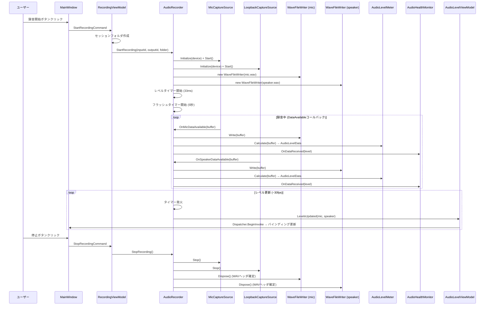
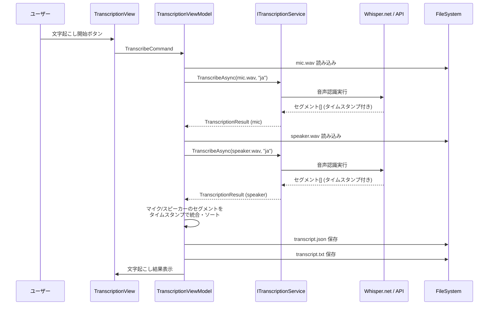
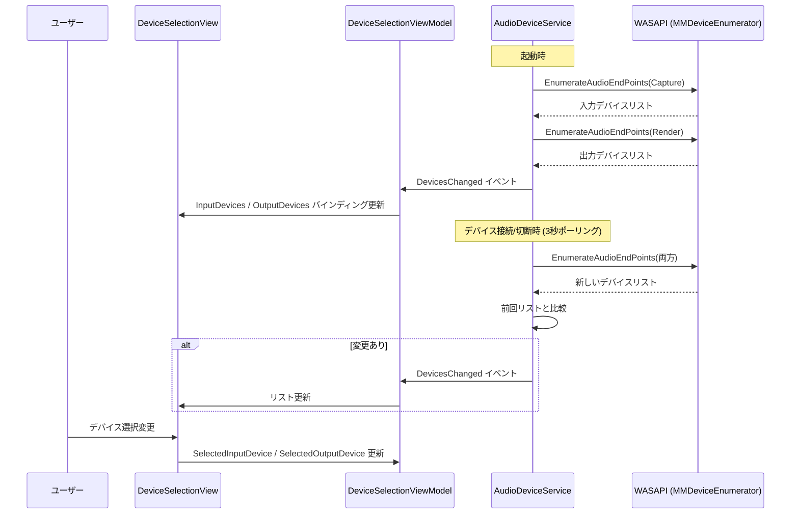
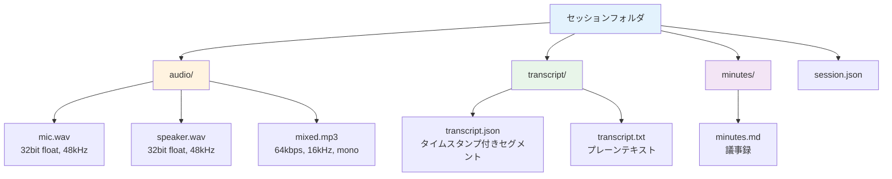
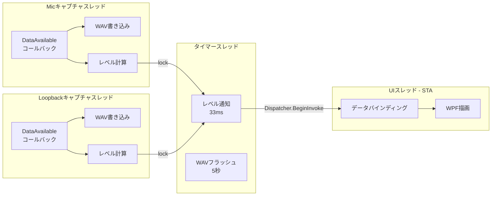

# データフロー・シーケンス図

## 1. 録音フェーズのシーケンス図

```mermaid
sequenceDiagram
    participant User as ユーザー
    participant UI as MainWindow
    participant RVM as RecordingViewModel
    participant AR as AudioRecorder
    participant Mic as MicCaptureSource
    participant LB as LoopbackCaptureSource
    participant MW as WaveFileWriter (mic)
    participant SW as WaveFileWriter (speaker)
    participant LM as AudioLevelMeter
    participant HM as AudioHealthMonitor
    participant ALVM as AudioLevelViewModel

    User->>UI: 録音開始ボタンクリック
    UI->>RVM: StartRecordingCommand
    RVM->>RVM: セッションフォルダ作成
    RVM->>AR: StartRecording(inputId, outputId, folder)
    AR->>Mic: Initialize(device) + Start()
    AR->>LB: Initialize(device) + Start()
    AR->>MW: new WaveFileWriter(mic.wav)
    AR->>SW: new WaveFileWriter(speaker.wav)
    AR->>AR: レベルタイマー開始 (33ms)
    AR->>AR: フラッシュタイマー開始 (5秒)

    loop 録音中 (DataAvailableコールバック)
        Mic->>AR: OnMicDataAvailable(buffer)
        AR->>MW: Write(buffer)
        AR->>LM: Calculate(buffer) → AudioLevelData
        AR->>HM: OnDataReceived(level)

        LB->>AR: OnSpeakerDataAvailable(buffer)
        AR->>SW: Write(buffer)
        AR->>LM: Calculate(buffer) → AudioLevelData
        AR->>HM: OnDataReceived(level)
    end

    loop レベル更新 (~30fps)
        AR->>AR: タイマー発火
        AR->>ALVM: LevelsUpdated(mic, speaker)
        ALVM->>UI: Dispatcher.BeginInvoke → バインディング更新
    end

    User->>UI: 停止ボタンクリック
    UI->>RVM: StopRecordingCommand
    RVM->>AR: StopRecording()
    AR->>Mic: Stop()
    AR->>LB: Stop()
    AR->>MW: Dispose() (WAVヘッダ確定)
    AR->>SW: Dispose() (WAVヘッダ確定)
```

## 2. 文字起こしフェーズのシーケンス図

```mermaid
sequenceDiagram
    participant User as ユーザー
    participant UI as TranscriptionView
    participant TVM as TranscriptionViewModel
    participant TS as ITranscriptionService
    participant WH as Whisper.net / API
    participant FS as FileSystem

    User->>UI: 文字起こし開始ボタン
    UI->>TVM: TranscribeCommand

    TVM->>FS: mic.wav 読み込み
    TVM->>TS: TranscribeAsync(mic.wav, "ja")
    TS->>WH: 音声認識実行
    WH-->>TS: セグメント[] (タイムスタンプ付き)
    TS-->>TVM: TranscriptionResult (mic)

    TVM->>FS: speaker.wav 読み込み
    TVM->>TS: TranscribeAsync(speaker.wav, "ja")
    TS->>WH: 音声認識実行
    WH-->>TS: セグメント[] (タイムスタンプ付き)
    TS-->>TVM: TranscriptionResult (speaker)

    TVM->>TVM: マイク/スピーカーのセグメントを<br/>タイムスタンプで統合・ソート
    TVM->>FS: transcript.json 保存
    TVM->>FS: transcript.txt 保存
    TVM->>UI: 文字起こし結果表示
```

## 3. デバイス選択のシーケンス図

```mermaid
sequenceDiagram
    participant User as ユーザー
    participant UI as DeviceSelectionView
    participant DVM as DeviceSelectionViewModel
    participant DS as AudioDeviceService
    participant API as WASAPI (MMDeviceEnumerator)

    Note over DS: 起動時
    DS->>API: EnumerateAudioEndPoints(Capture)
    API-->>DS: 入力デバイスリスト
    DS->>API: EnumerateAudioEndPoints(Render)
    API-->>DS: 出力デバイスリスト
    DS->>DVM: DevicesChanged イベント
    DVM->>UI: InputDevices / OutputDevices バインディング更新

    Note over DS: デバイス接続/切断時 (3秒ポーリング)
    DS->>API: EnumerateAudioEndPoints(両方)
    API-->>DS: 新しいデバイスリスト
    DS->>DS: 前回リストと比較
    alt 変更あり
        DS->>DVM: DevicesChanged イベント
        DVM->>UI: リスト更新
    end

    User->>UI: デバイス選択変更
    UI->>DVM: SelectedInputDevice / SelectedOutputDevice 更新
```

## 4. 録音データのファイル構造

```mermaid
graph TD
    A[セッションフォルダ] --> B[audio/]
    A --> C[transcript/]
    A --> D[minutes/]
    A --> E[session.json]

    B --> F[mic.wav<br/>32bit float, 48kHz]
    B --> G[speaker.wav<br/>32bit float, 48kHz]
    B --> G2[mixed.mp3<br/>64kbps, 16kHz, mono]

    C --> H[transcript.json<br/>タイムスタンプ付きセグメント]
    C --> I[transcript.txt<br/>プレーンテキスト]

    D --> J[minutes.md<br/>議事録]

    style A fill:#E3F2FD
    style B fill:#FFF3E0
    style C fill:#E8F5E9
    style D fill:#F3E5F5
```

## 5. スレッドモデル

```mermaid
graph LR
    subgraph UIスレッド[UIスレッド - STA]
        WPF[WPF描画]
        Bind[データバインディング]
    end

    subgraph MicThread[Micキャプチャスレッド]
        MicCB[DataAvailable<br/>コールバック]
        MicW[WAV書き込み]
        MicL[レベル計算]
    end

    subgraph LBThread[Loopbackキャプチャスレッド]
        LBCB[DataAvailable<br/>コールバック]
        LBW[WAV書き込み]
        LBL[レベル計算]
    end

    subgraph TimerThread[タイマースレッド]
        LT[レベル通知<br/>33ms]
        FT[WAVフラッシュ<br/>5秒]
    end

    MicCB --> MicW
    MicCB --> MicL
    LBCB --> LBW
    LBCB --> LBL

    MicL -->|lock| LT
    LBL -->|lock| LT
    LT -->|Dispatcher.BeginInvoke| Bind
    Bind --> WPF
```
